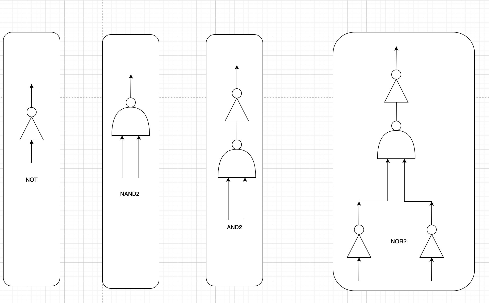
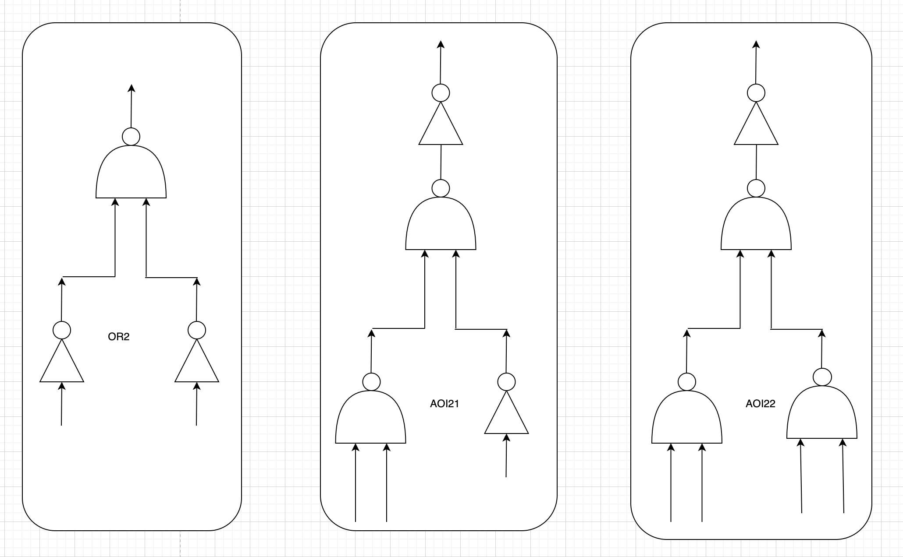
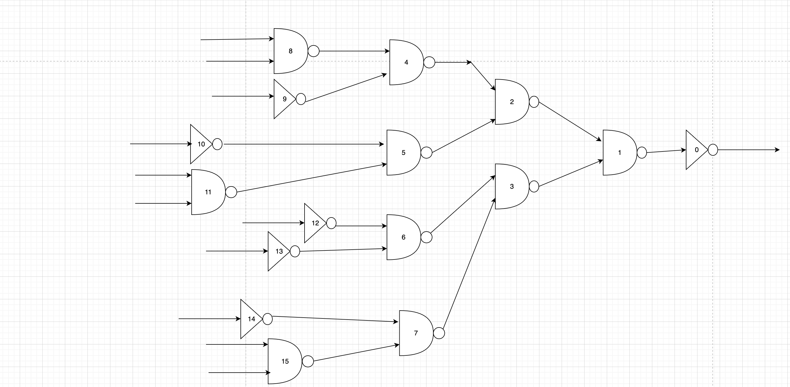

# Technology Mapping using minimum cost tree-covering

This repository implements technology mapping algorithm using minimum cost tree-covering.

Technology mapping takes synthesized netlist and convert into another netlist which uses technology library cells. These cells have actual area, dimension and delay while the input synthesized netlist is just connection of gates.

The input netlist and library cells are assumed to be a tree and contain just Not and Nand2 cells. Each technology cell is mapped to every node in input netlist and technology cells are used so that the cost is minimum. The cost can be area or delay or maybe some combination of these two metrics.

## Compiling the code:

Use this command:

> source run.tcl # For compilation

> ./bin/techmap -v  # To run the code with debug mode enabled

OR

> ./bin/techmap  #To run with debug mode disabled

## Brief explanation of source code:

1) src/Gate/gate.* : Gate class is described which has function to process a gate like adding gate on inuput side.

2) src/LibraryCells/libraryCells.* : All library cells are constructed.

    List of Library cells:
    i) NOT
   
    ii) NAND2
   
    iii) OR2
   
    iv) AND2
   
    v) NOR2
   
    vi) AOI21 ( And-or-Invert)
   
    vii) AOI22 (And-or-Invert containing 2 input for each of 2 nand2 cells )

    There is another cell AOI21_rotated which is same as AOI21 but it is just in rotated form. This cell is constructed for the tech mapping using technology mapping.

    

    
4) src/Netlist/netlist.* : This class constructs input netlist. Currently netlist is constructed by adding function and use it for every circuit.

    
    Above is sample netlist which is made of NOT and NAND2 gates
6) src/CircuitCreator/circuitCreator.*: These files contain helper function used to create netlist.

7) src/TreeMatch/treeMatch.* : This class contains function for recursive tree matching and minimum cost tree covering.

## Log file:

1) run.log: Log file of output generated for a sample netlist showing the possible mapping and best mapping which provide minimum cost.

-> The output is the valid mapping for every node in netlist. We will also get best mapping and the minimum cost that we get using that mapping.

TODO: Need to generate final mapped netlist. Will push the change once it is done.

## Understanding the output:

Gate id: 121, type: NOT
**********************************
Tech map: NOT

Cost: 2

Leaf node:

(Gate id: 122, type: NAND2)
**********************************
Tech map: AND2

Cost: 4

Leaf node:

(Gate id: 123, type: NOT),

(Gate id: 124, type: NOT)
**********************************
Tech map: NOR2

Cost: 6

Leaf node: 

(Gate id: 125, type: INPUT),

(Gate id: 126, type: INPUT)
**********************************

In above example,we have a netlist with multiple gates and above is possible mapping at the node where NOT gate is present. 

Let's look at first possible mapping:

Tech map: NOT

Cost: 2

Leaf node:

Gate id: 122, type: NAND2

We can use NOT cell from our library cell list. If we use it, the cost will be 2 and the leaf node has Nand2 gate which in-turn needs to be mapped.

Now let's look at another possible mapping.

Tech map: AND2

Cost: 4

Leaf node: 

Gate id: 123, type: NOT

Gate id: 124, type: NOT

We can use AND2 gate and the cost will be 4. The leaf node will be Not gates connected to input of mapped AND2 gate.

Now let's look at the best mapping which provided us minimum cost:

Minimum cost: 6

Printing Best mapping

Gate id: 121, type: NOT :: NOT, cost: 2

Gate id: 122, type: NAND2 :: OR2, cost: 4

Gate id: 125 :: INPUT

Gate id: 126 :: INPUT

Above, the minimum cost is 6 and we have mapped cell corresponding to each of the node.

For Gate id: 121, we had NOT gate in input netlist and this gate is mapped to NOT gate from the technology cells.

For gate id: 122, we had NAND2 gate in input netlist and this gate is mapped to OR2 gate in technology cell. If we look at the mapping list, we will see the OR2 gate has input pad in its input side, which are mentioned in next two cells.

## Reference:

I took this Coursera course: VLSI: Logic to Layout and learnt about technology mapping. I really liked the course and wanted to implement something which uses knowledge of data structure and algorithm. The minimum cost tree covering is great application of tree data structure, dynamic programming and recursive algorithm.

Link to course:
https://www.coursera.org/learn/vlsi-cad-layout 
